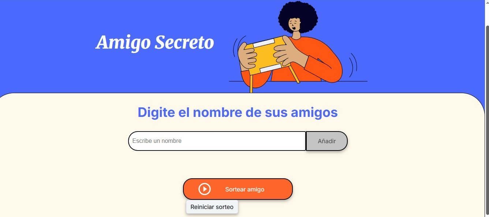
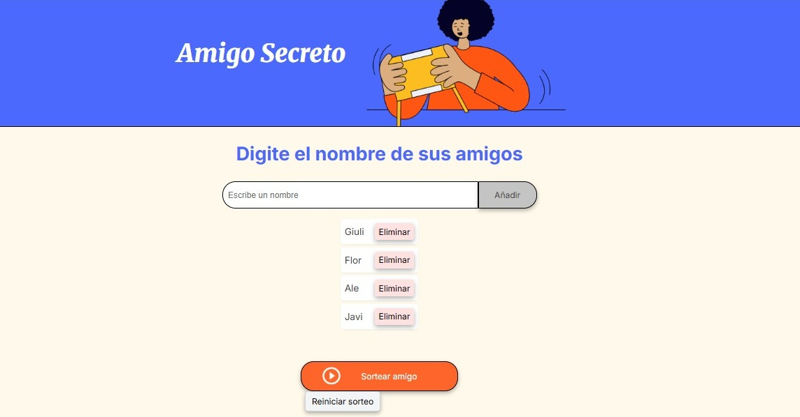
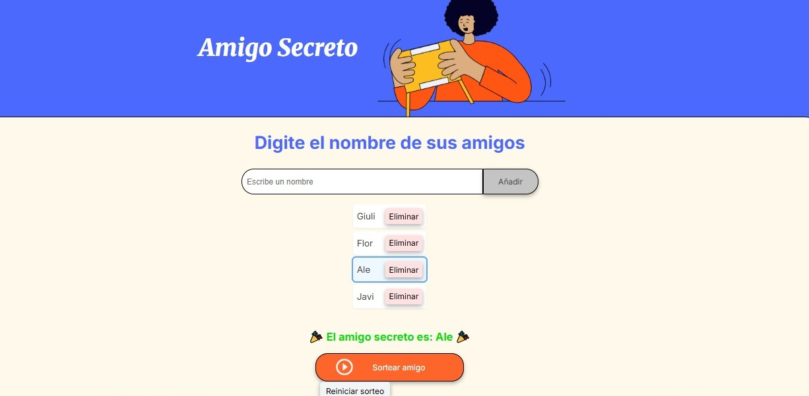
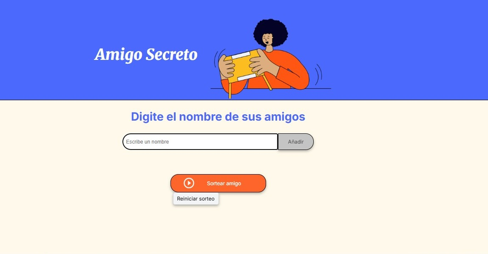

# Challenge: Amigo Secreto 🎁

Aplicación desarrollada como **challenge del curso de alura latam**, que permite ingresar nombres de amigos y realizar un sorteo aleatorio para descubrir quién es el "amigo secreto".  

Incluye validación de entrada, visualización clara de la lista, posibilidad de eliminar nombres, sorteo aleatorio y un botón de **Reiniciar sorteo** que deja todo como al inicio.

---

## 🚀 Cómo usar la aplicación

1. **Pantalla inicial**  
   Al abrir la aplicación, verás un campo para escribir los nombres y los botones principales.  
   

---

2. **Agregar participantes**  
   Escribe un nombre y presiona el botón **Añadir** (o la tecla Enter).  
   El nombre aparecerá en una lista ordenada.  
   

   👉 Cada participante tiene a la derecha un botón **Eliminar**, en caso de que quieras quitarlo.

---

3. **Realizar el sorteo**  
   Cuando hayas cargado a todos tus amigos, presiona **Sortear amigo**.  
   Se elegirá un nombre de manera aleatoria, que aparecerá resaltado en la lista y mostrado en pantalla.  
   

---

4. **Reiniciar el sorteo**  
   Si querés empezar de nuevo, presiona **Reiniciar sorteo**.  
   Esto borrará tanto la lista de participantes como el resultado, dejando la app lista para volver a usarse.  
   

---

## 🛠️ Funcionalidades

- Validación: no se pueden añadir nombres vacíos.  
- Lista clara y alineada, con botón **Eliminar** para cada participante.  
- Sorteo aleatorio con resultado destacado.  
- Botón **Reiniciar sorteo** que limpia todo de una vez.  
- Accesibilidad: soporte para tecla Enter y `aria-live` para resultados.

---

## 📂 Estructura del proyecto

